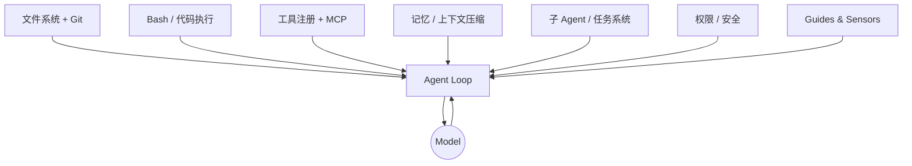
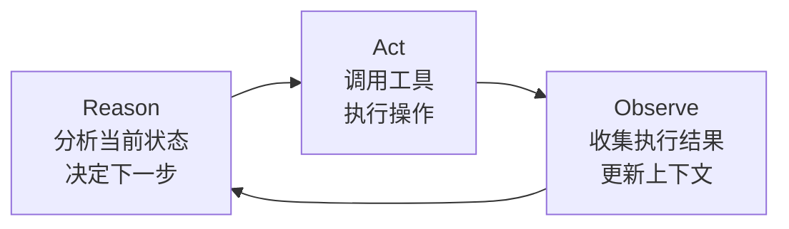
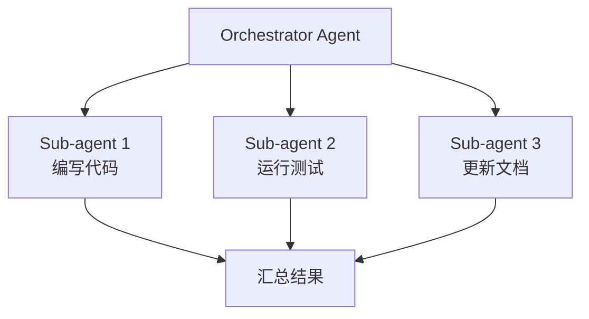

# Core Components

Harness 的七大核心组件，综合 LangChain、Martin Fowler、OpenAI 的工程实践总结。

---

## 组件总览

---

## 1. 文件系统 + Git

**文件系统**是 harness 最基础的状态存储原语。Agent 需要一个工作空间来：
- 读取输入数据和代码库
- 写入中间产物和最终输出
- 在工具调用之间持久化状态（对话轮次间不丢失）

关联：[[agent-file-system]] 有完整的 VFS 工程实现讨论。

**Git** 在文件系统之上加一层版本控制：
- **追踪工作进度**：每个检查点一个 commit，agent 可以回溯
- **回滚错误**：agent 走偏时可以 `git reset`
- **分支实验**：并行尝试多种方案，只保留最优结果
- **Worktree 隔离**：多个子 agent 同时工作而不互相干扰

Git 让 agent 的工作具备**可审计性**——人类可以在任意时间点介入检查。

---

## 2. Bash / 代码执行

核心原则：**与其为每种可能的操作造一个专用工具，不如给 agent 一个通用的 bash 工具让它自主写代码解决问题。**

这与 [[agent-tool-design]] 的 Progressive Disclosure 原则相呼应：通用工具（bash）适合能力强的 agent，专用工具适合需要约束的场景。

实践中，bash 工具是 harness 中调用最频繁、灵活性最高的组件，但也需要最严格的权限控制（见组件 7）。

---

## 3. Agent Loop（ReAct 循环）

经典的 **Reason → Act → Observe** 三步循环：

Harness 的 agent loop 负责：
1. 组装发给 Model 的完整上下文（系统提示 + 记忆 + 工具结果 + 任务状态）
2. 解析 Model 返回的工具调用
3. 实际执行工具调用
4. 将结果注入下一轮上下文
5. 判断任务是否完成（或触发人工介入）

---

## 4. 工具注册 + MCP

工具注册层管理 agent 可以使用的所有能力：
- **Schema 定义**：每个工具的输入输出格式（JSON Schema）
- **权限绑定**：哪些工具在哪些上下文下可用
- **执行沙箱**：工具在隔离环境中运行，失败不影响主流程

**MCP（Model Context Protocol）** 是 Anthropic 推出的工具注册标准协议，让工具以进程外服务的形式注册，harness 通过标准接口调用。优势：
- 工具可热插拔，不需要重启 agent
- 跨 harness 复用（同一个 MCP 服务可以给多个 harness 使用）
- 权限隔离更清晰

---

## 5. 记忆与上下文压缩

长任务的核心瓶颈：上下文窗口有限，但任务状态无限增长。

Harness 通常实现多级记忆策略：

| 层级 | 机制 | 时效 |
|------|------|------|
| **会话内工作记忆** | 完整对话历史在上下文中 | 当前会话 |
| **Auto-compaction** | 触发阈值时 LLM 自动压缩旧轮次 | 当前会话 |
| **Session Memory** | 会话结束时提取关键信息写文件 | 跨会话 |
| **长期知识库** | 结构化文档（如 CLAUDE.md、docs/）| 永久 |

详细实现见 [[llm/memory/index|Context Window Management]]。

---

## 6. 子 Agent / 任务系统

复杂任务分解为并行子任务，由多个 agent 协同完成：

关键机制：
- **依赖图**：任务 B 依赖任务 A 的输出，harness 自动排序
- **Worktree 隔离**：每个子 agent 在独立的 Git worktree 中工作，避免冲突
- **异步协调**：orchestrator 不阻塞等待，子 agent 完成后通知

---

## 7. 权限与安全

Harness 的护栏层，防止 agent 执行不可逆或危险操作：

- **命令白名单（allow rules）**：只允许预定义的 bash 命令
- **Path rules**：限制可读写的文件路径范围
- **审批门（approval gates）**：高风险操作（push、delete、外部 API 调用）需要人工确认
- **沙箱执行**：代码在容器或 worktree 中运行，失败不影响主环境

权限设计原则：**最小权限**——只给 agent 完成当前任务所必需的权限，而不是所有可能用到的权限。

---

## 8. Guides & Sensors

来自 Martin Fowler / Birgitta Böckeler 的框架，是对以上所有组件的**控制层抽象**。详见 [[llm/concepts/agents-harness/guides-vs-sensors|Guides vs Sensors]]。

- **Guides（引导）**：在 agent 行动前提供方向性约束
- **Sensors（传感器）**：在 agent 行动后观察并帮它自我纠正

---

## 相关页面

- [[llm/concepts/agents-harness/what-is-harness|What Is Harness]] — 为什么需要这些组件
- [[llm/concepts/agents-harness/guides-vs-sensors|Guides vs Sensors]] — 控制层设计模型
- [[llm/concepts/agents-harness/harness-engineering-lessons|Harness Engineering Lessons]] — 大厂的组件选择经验
