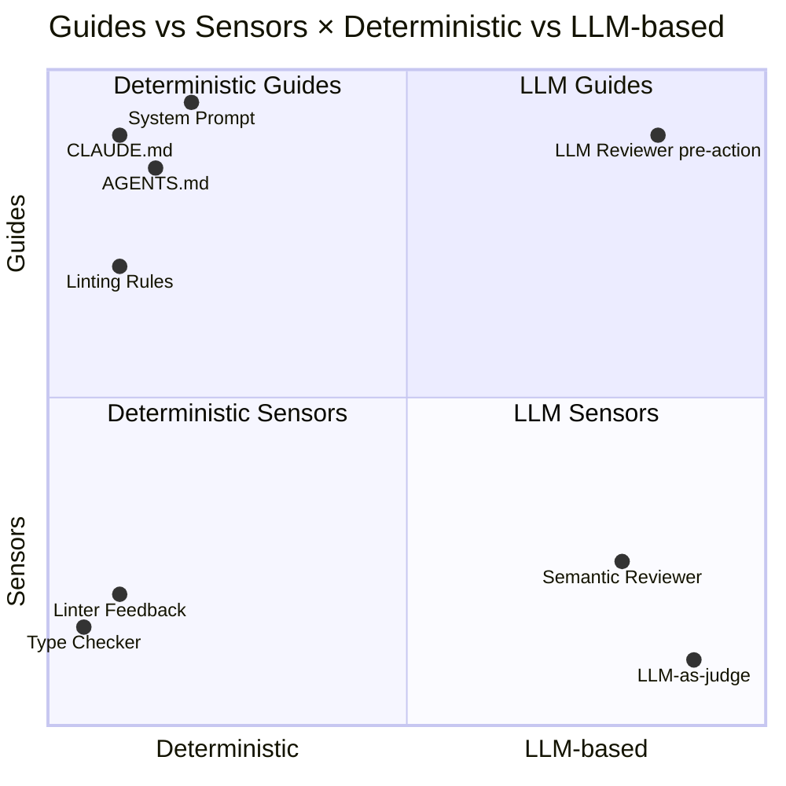

# Guides vs Sensors

来自 Martin Fowler 博客（作者 Birgitta Böckeler，Thoughtworks）的框架。这是目前对 harness 控制层最系统的分类，把所有控制机制归入两个维度的四象限。

---

## 核心直觉

Agent 是非确定性系统，不能用传统确定性测试完全覆盖。但也不能放任 agent 自由运行——代价太高。

解决方案：建立两种方向的控制回路。

| | **Guides（引导）** | **Sensors（传感器）** |
|---|---|---|
| **方向** | 前馈（feed-forward）| 反馈（feedback）|
| **时机** | Agent 行动**之前** | Agent 行动**之后** |
| **目标** | 预判行为，提前引导 | 观察结果，帮 agent 自我纠正 |

---

## 两个维度 × 两种方向 = 四象限

第二个维度是**执行机制**：

- **计算型（Deterministic）**：用代码实现，便宜、快速、可重复
- **推理型（LLM-based）**：用 LLM 实现，昂贵、灵活、适合语义判断

---

## 象限详解

### 象限 1：Deterministic Guides（计算型引导）

在 agent 行动前，用代码为 agent 设置约束和方向。

**典型实现：**
- `CLAUDE.md` / `AGENTS.md`：给 agent 的结构化说明文档
- 系统提示（system prompt）中的规则和约束
- 工具 schema 中的参数约束（required fields、enum 限制）
- Linting rules 注入到上下文（"你的代码必须通过以下 lint 规则"）
- 允许列表（allowlist）：只暴露特定工具

**特点：** 成本极低，每次都跑，适合作为基础护栏。缺点是只能表达简单规则，无法处理语义层面的约束。

---

### 象限 2：LLM-based Guides（推理型引导）

在 agent 行动前，用 LLM 做更复杂的前置审查或规划。

**典型实现：**
- **Pre-flight reviewer**：让另一个 LLM 审查 agent 的行动计划，发现风险后反馈给主 agent
- **Task decomposer**：LLM 先把大任务拆成有依赖关系的子任务，再交给 agent 执行
- **Context summarizer**：对过长的上下文做语义压缩，再注入 agent

**特点：** 成本较高（多一次 LLM 调用），但能理解语义，捕捉计算型 guides 无法表达的风险。适合高风险操作前的检查。

---

### 象限 3：Deterministic Sensors（计算型传感器）

在 agent 行动后，用代码观察结果并生成结构化反馈。

**典型实现：**
- **Linter 反馈**：agent 写完代码后跑 linter，把错误信息注入下一轮上下文
- **类型检查**：`tsc --noEmit` 输出发给 agent 自我修复
- **测试结果**：跑单元测试，把失败堆栈返回给 agent
- **自定义 linter**：专门为 LLM 消费设计输出格式的检查器（不同于面向人类的 linter）

**关键洞察（来自 Martin Fowler 文章）：** 最有效的 sensors 是**专门为 LLM 消费设计**的工具，而不是直接复用面向人类的工具输出。LLM 需要的反馈格式和人类不同——更简洁、更结构化、带明确的"应该怎么改"提示。

**特点：** 成本低，信号精确，每次都跑。

---

### 象限 4：LLM-based Sensors（推理型传感器）

在 agent 行动后，用 LLM 做语义层面的质量评估。

**典型实现：**
- **LLM-as-judge**：让另一个 LLM 评估 agent 的输出质量（准确性、完整性、风格）
- **Semantic code reviewer**：检查代码是否符合业务逻辑（单纯的 linter 无法判断）
- **Self-critique loop**：同一个 LLM 对自己的输出做反思评估（需要防止自我肯定偏差）

**特点：** 成本最高，但能发现其他象限都无法捕捉的问题。适合最终输出的质量把关，而不是每一步都跑。

---

## 设计原则

1. **分层防御**：Deterministic controls 作为基础层，LLM-based controls 作为补充层。不要用推理型替代计算型。

2. **频率匹配成本**：
   - Deterministic Sensors → 每次工具调用后都跑
   - LLM Sensors → 关键检查点才跑（如 PR 提交前）
   - LLM Guides → 高风险操作前才跑

3. **为 LLM 设计反馈格式**：Sensor 的输出是给 LLM 看的，不是给人看的。格式应清晰、可操作，直接说"你应该改什么"而不只是"这里有问题"。

4. **Guide 优先于事后纠错**：在上游设置好约束，比在下游发现错误并修复便宜得多。

---

## 相关页面

- [[llm/concepts/agents-harness/core-components|Core Components]] — Guides & Sensors 在组件层面的位置
- [[llm/concepts/agents-harness/harness-engineering-lessons|Harness Engineering Lessons]] — 实际工程中如何落地这个框架
- [[agent-tool-design]] — 工具设计如何配合 Sensor 提供可机读的反馈
