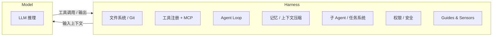

# What Is Harness

## 核心公式

$$\text{Agent} = \text{Model} + \text{Harness}$$

**Harness** 是模型之外的所有代码、配置和执行逻辑。模型只能处理输入输出文本，无法自主维护状态、跨会话延续任务、安全执行副作用。Harness 填补这一切空白。

换一个角度：如果 Model 是引擎，Harness 就是底盘、传动、油箱和仪表盘——引擎离开底盘无法驱动车辆。

---

## 为什么需要 Harness

### 模型的固有局限

| 局限 | 表现 |
|------|------|
| **无状态** | 每次调用独立，无法跨会话记忆任务进度 |
| **无副作用执行能力** | 模型不能直接读写文件、调用 API、运行代码 |
| **上下文窗口有限** | 长任务的中间状态无法全部放入 prompt |
| **无法自我纠错** | 没有外部反馈机制，模型不知道自己偏轨 |

### 耐久性（Durability）是关键

顶级模型在静态 benchmark 上差距在收窄。但任务越长越复杂，差距越明显。真正的瓶颈是**耐久性**：agent 经过几百次工具调用、上千轮之后，还能不能不跑偏？

耐久性不来自模型能力的线性外推，而来自 harness 的系统设计：检查点、回滚、反馈循环、子任务分解。

---

## Harness 的定义边界

Harness 包裹着 Model，负责：
1. 组装发给 Model 的 prompt（系统提示、工具 schema、记忆、任务上下文）
2. 解析 Model 返回的工具调用并实际执行
3. 将执行结果反馈回 Model
4. 管理状态、权限和错误恢复

---

## 与传统软件工程的区别

传统软件工程追求**确定性**：给定输入，输出总是相同的。测试可以完全覆盖路径，行为可以被精确规定。

Harness 工程的对象是**非确定性系统**。模型的输出不可完全预测，因此 harness 需要两类控制机制：

| 控制类型 | 机制 | 特点 |
|---------|------|------|
| **计算型（Deterministic）** | linter、类型检查、格式校验 | 便宜、快速、每次都跑 |
| **推理型（LLM-based）** | LLM-as-judge、语义审查 | 昂贵、但能给出高价值判断 |

这两类机制分别对应 [[llm/concepts/agents-harness/guides-vs-sensors|Guides vs Sensors]] 框架的两个维度。

---

## Harness 与 Framework 的区别

- **Framework**（如 LangChain、LlamaIndex）：提供可复用的 harness 组件，开箱即用但抽象层可能掩盖问题。
- **Harness**：针对特定任务和模型定制的执行层，可以基于 framework 构建，也可以从头写。

Philipp Schmid 的观察：Manus 六个月重构 harness 五次，LangChain 一年把 Open Deep Research 重构三次。这说明 harness 本身就是演化中的系统，不存在一劳永逸的方案。

---

## 相关页面

- [[llm/concepts/agents-harness/core-components|Core Components]] — 七大核心组件详解
- [[llm/concepts/agents-harness/guides-vs-sensors|Guides vs Sensors]] — 前馈与反馈的控制框架
- [[agent-tool-design]] — 工具设计如何影响 harness 复杂度
