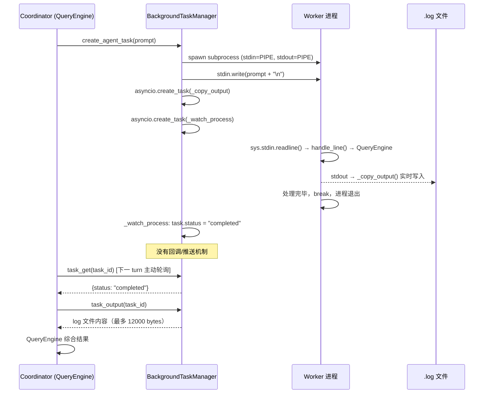

# Harness Agent — Background Worker 实现

> 上级页面：[[Harness Agent]]  
> 相关页面：[[harness-agent/inline-agent|Inline Agent]]、[[harness-agent/multi-agent-coordination|Multi-Agent 协调机制]]

---

## 一、Background Worker 是什么

Background Worker 不是"LLM agent 的别称"，而是一个更宽泛的概念：**任何以子进程形式在后台运行、通过 stdin/stdout pipe 通信的任务**。

`TaskType` 的完整枚举：

```python
TaskType = Literal[
    "local_bash",           # 任意 shell 命令，无 LLM
    "local_agent",          # oh --task-worker，LLM agent
    "remote_agent",         # 连接远端服务的变体
    "in_process_teammate",  # asyncio Task，不是子进程
]
```

`BackgroundTaskManager` 对外暴露两个创建方法：

```python
create_shell_task(command, description, cwd)   # → local_bash
create_agent_task(prompt, description, cwd)    # → local_agent（内部调 create_shell_task）
```

`create_agent_task` 只是把 command 固定为 `oh --task-worker` 再往 stdin 写 prompt，底层完全共用同一套 pipe + log 机制。

**实践意义**：coordinator 的 verify 步骤完全可以是 `pytest` 或 `npm run build` 的 bash task，不需要 LLM。`task_output`/`task_get` 对两种类型的处理方式相同。

---

## 二、进程生命周期

### 2.1 启动

```python
# BackgroundTaskManager._start_process()
process = await create_shell_subprocess(
    task.command,
    cwd=task.cwd,
    stdin=asyncio.subprocess.PIPE,    # 父进程可写入
    stdout=asyncio.subprocess.PIPE,   # 父进程可读取
    stderr=asyncio.subprocess.STDOUT, # stderr 合并进 stdout
)
```

进程一创建，同时启动两个 asyncio Task：

```python
# Task 1：持续把子进程 stdout 追加写入 .log 文件
asyncio.create_task(self._copy_output(task_id, process))

# Task 2：等进程退出，更新 TaskRecord.status
asyncio.create_task(self._watch_process(task_id, process, generation))
```

task_id 的格式：`{prefix}{uuid4.hex[:8]}`，前缀按类型区分：

| TaskType | 前缀 | 示例 |
|----------|------|------|
| `local_bash` | `b` | `b3f2a1c4` |
| `local_agent` | `a` | `a7e9d2b1` |
| `remote_agent` | `r` | `r1a4f8c2` |
| `in_process_teammate` | `t` | `t5b3e9d7` |

### 2.2 stdout → log 文件

```python
async def _copy_output(self, task_id, process):
    while True:
        chunk = await process.stdout.read(4096)   # 流式读取
        if not chunk:
            return
        async with self._output_locks[task_id]:
            with self._tasks[task_id].output_file.open("ab") as f:
                f.write(chunk)
```

输出文件路径：`~/.openharness/tasks/<task_id>.log`，追加写入，coordinator 通过 `task_output` 工具读取（默认最多 12000 bytes tail）。

### 2.3 进程退出监控

```python
async def _watch_process(self, task_id, process, generation):
    reader = asyncio.create_task(self._copy_output(task_id, process))
    return_code = await process.wait()   # 等待进程结束
    await reader                         # 确保 log 写完

    task = self._tasks[task_id]
    task.return_code = return_code
    task.status = "completed" if return_code == 0 else "failed"
    task.ended_at = time.time()
```

`generation` 字段用于处理重启场景：若进程已被重启，旧的 waiter 检测到 generation 不匹配时直接返回，避免把旧进程的退出码写成新进程的状态。

---

## 三、LLM Agent Worker 的入口：`run_task_worker()`

当 `task_type = local_agent` 时，子进程运行 `oh --task-worker`，进入 `run_task_worker()`：

```python
async def run_task_worker(...):
    bundle = await build_runtime(...)   # 完整 QueryEngine + 工具集
    await start_runtime(bundle)

    while True:
        raw = await asyncio.to_thread(sys.stdin.readline)  # 阻塞等 stdin
        if raw == "":          # EOF = 父进程关闭管道 = 退出
            break
        line = _decode_task_worker_line(raw)
        if not line:
            continue
        await handle_line(bundle, line, ...)   # 交给 QueryEngine 处理
        break   # ← 处理完一条立即退出
```

**一次性设计**：处理完第一条 stdin 消息就 break 退出进程。这是刻意的设计——保证每次任务状态干净，无历史污染。

### stdin 消息格式解析

```python
def _decode_task_worker_line(raw: str) -> str:
    stripped = raw.strip()
    try:
        payload = json.loads(stripped)
    except json.JSONDecodeError:
        return stripped                      # 纯文本（初始 prompt）
    if isinstance(payload, dict):
        text = payload.get("text")
        if isinstance(text, str):
            return text.strip()              # JSON envelope（send_message 来的）
    return stripped
```

两种来源：
- **初始 prompt**：`create_agent_task()` 写入的纯文本
- **后续消息**：`SubprocessBackend.send_message()` 写入的 `{"text": "...", "from": "...", "timestamp": "..."}`

### stdout 输出

Worker 的 `_render_event` 把 LLM 输出实时写入 stdout：

```python
async def _render_event(event: StreamEvent) -> None:
    if isinstance(event, AssistantTextDelta):
        sys.stdout.write(event.text)
        sys.stdout.flush()
```

这些字节被父进程的 `_copy_output()` 实时捕获写入 `.log` 文件。

---

## 四、Prompt 写入时序

```
create_agent_task()
    ↓
create_shell_task()         # 启动进程，建立 pipe
    ↓
_start_process()            # asyncio.create_subprocess_shell(stdin=PIPE, ...)
    ↓ 进程已运行，stdin pipe 建立
write_to_task(id, prompt)   # 立即写入初始 prompt
    ↓
process.stdin.write(prompt + "\n")
process.stdin.drain()
    ↓
子进程 sys.stdin.readline() 读到 prompt
handle_line() → QueryEngine.submit_message(prompt) → LLM 开始工作
```

写入和进程启动是顺序的（`create_shell_task` 返回后才写），但子进程启动有时间差，`stdin.readline()` 会阻塞等待直到数据到来，所以不会丢失。

---

## 五、`send_message` 的续接与重启

Worker 处理完任务后进程退出，stdin pipe 关闭。当 coordinator 调用 `send_message` 时：

```python
async def write_to_task(self, task_id: str, data: str) -> None:
    async with self._input_locks[task_id]:
        process = await self._ensure_writable_process(task)
        process.stdin.write((data.rstrip("\n") + "\n").encode("utf-8"))
        try:
            await process.stdin.drain()
        except (BrokenPipeError, ConnectionResetError):
            # pipe 断了 → 重启进程
            process = await self._restart_agent_task(task)
            process.stdin.write(...)
            await process.stdin.drain()
```

`_restart_agent_task()` 重新执行相同的 `command`（`oh --task-worker`），新进程读取新 prompt：

```python
async def _restart_agent_task(self, task: TaskRecord):
    restart_count = int(task.metadata.get("restart_count", "0")) + 1
    task.metadata["restart_count"] = str(restart_count)
    task.status = "running"
    task.started_at = time.time()
    task.ended_at = None
    task.return_code = None
    return await self._start_process(task.id)   # 全新进程
```

**关键限制**：重启的是全新进程，没有上一次运行的 LLM 上下文。**KV cache 完全丢失**。这是 subprocess backend 相比 in_process backend 的核心代价。

---

## 六、环境变量继承

`spawn_utils.build_inherited_env_vars()` 决定子进程能看到哪些环境变量：

```python
def build_inherited_env_vars() -> dict[str, str]:
    env = {
        "OPENHARNESS_AGENT_TEAMS": "1",
        "CLAUDE_CODE_COORDINATOR_MODE": "0",  # 禁止 worker 变成 coordinator
    }
    # 继承：API key、Base URL、代理设置、CA 证书、provider 配置
    for key in _TEAMMATE_ENV_VARS:
        value = os.environ.get(key)
        if value:
            env[key] = value
    return env
```

`CLAUDE_CODE_COORDINATOR_MODE=0` 是防递归的关键——确保 worker 不会再启 coordinator 模式。

`get_teammate_command()` 决定用哪个可执行文件：

```
优先级：
1. OPENHARNESS_TEAMMATE_COMMAND 环境变量（operator 覆盖）
2. sys.executable（当前 Python 解释器，继承同一 venv）
3. PATH 上的 openharness 入口点
4. 兜底：python
```

使用 `sys.executable` 确保 worker 和 coordinator 用同一个 venv/源码树，避免版本不一致。

---

## 七、结果如何回到 Coordinator

这是架构上最微妙的地方，实际实现和 coordinator system prompt 的描述之间有一层分工。

### 7.1 Coordinator system prompt 描述的目标

> Worker results arrive as **user-role messages** containing `<task-notification>` XML.

### 7.2 实际机制：主动轮询（当前唯一实现路径）

**`_watch_process()` 不触发任何回调**：它只是把 `task.status` 置为 `"completed"`，没有任何异步通知机制。

`tasks_snapshot` 事件也是被动的——它只在工具调用完成后由 backend_host 顺带发出，不会在 coordinator 空闲等待时主动推送。

**实际运作方式：coordinator LLM 自己轮询**：

```
Coordinator turn N:
  [tool_use: agent, ...]
  [tool_result: task_id=a001]   ← spawn 完毕，current turn 结束

Coordinator turn N+1:
  [tool_use: task_get, {task_id: "a001"}]   ← 主动查询
  [tool_result: {status: "running"}]

Coordinator turn N+2:
  [tool_use: task_get, {task_id: "a001"}]   ← 再次查询
  [tool_result: {status: "completed"}]

  [tool_use: task_output, {task_id: "a001"}]  ← 读取结果
  [tool_result: "## 分析结果\n..."]
```

这意味着 coordinator 的 **"等待"不是真正的阻塞**，而是通过多个 turn 的 `task_get` 轮询实现的。每次轮询都是一次 LLM 推理，消耗 token 和时间。Coordinator system prompt 中有关 `task_get`/`task_output`/`task_list` 的说明即为此服务。

**关于 `<task-notification>` 自动注入的实现状态**：

Coordinator system prompt 描述的"worker results 以 user-role messages 形式送达"是一个**设计目标，尚未在当前代码中完全实现**：

- `format_task_notification()` 在 Python 侧定义，但没有任何代码路径自动调用它
- TypeScript 前端（`useBackendSession.ts` / `App.tsx`）中，`tasks` state 只用于 `StatusBar` 显示，没有"task completed → 格式化 XML → submit_line"的逻辑
- `_emit_swarm_status()` 在 backend_host 中定义但从未被调用过

这是一个**明确的实现缺口**：自动注入机制在文档和 system prompt 中已设计完整，但实际代码仍依赖 coordinator 主动轮询。

### 7.3 Coordinator 的主动轮询（当前实现路径）

Coordinator 通过工具主动查询任务状态：

```python
task_get(task_id)      # 查 TaskRecord.status / started_at / ended_at
task_output(task_id)   # 读 .log 文件内容（默认 tail 12000 bytes）
task_list()            # 列出所有任务及状态
```

这是 coordinator LLM 在没有 UI 层的场景下（如 `run_print_mode`）的备用路径。

### 7.4 `<task-notification>` XML 格式

```xml
<task-notification>
<task-id>researcher@default</task-id>
<status>completed</status>
<summary>分析完成，发现 2 处问题</summary>
<result>
  ## 分析结果
  1. Node.js 版本不匹配
  2. 缺少 DATABASE_URL mock
</result>
<usage>
  <total_tokens>12847</total_tokens>
  <tool_uses>7</tool_uses>
  <duration_ms>23412</duration_ms>
</usage>
</task-notification>
```

`<result>` 和 `<usage>` 是可选段。Coordinator LLM 通过 `<task-id>` 字段获得后续 `send_message` 的 `to` 参数。

---

## 八、完整数据流图



---

## 九、in_process backend 对比

`in_process_teammate` 不走 subprocess，而是 `asyncio.create_task()`，在同一 Python 进程内并发：

| 维度 | subprocess (local_agent) | in_process_teammate |
|------|--------------------------|---------------------|
| 进程边界 | 独立子进程 | 同一进程 asyncio Task |
| LLM 上下文（续接时） | 全新，KV cache 丢失 | 可保留（message_queue 注入） |
| 可被 task_get 轮询 | 是 | 否（ID 是进程内部的） |
| 故障隔离 | worker crash 不影响 coordinator | crash 可能影响整个进程 |
| 启动开销 | 进程 fork + Python 解释器初始化 | 几乎为零 |
| 适合场景 | 生产任务，需要 task 工具轮询 | 轻量快速，不需要外部可见性 |

`AgentTool.execute()` 强制使用 subprocess，原因是 in_process 的 task_id 对 `task_get`/`task_list` 不可见。

---

## 参考

- 源码：`src/openharness/tasks/manager.py`
- 源码：`src/openharness/tasks/types.py`
- 源码：`src/openharness/ui/app.py` — `run_task_worker()`
- 源码：`src/openharness/swarm/subprocess_backend.py`
- 源码：`src/openharness/swarm/spawn_utils.py`
- 相关：[[harness-agent/inline-agent|Inline Agent vs Background Worker]]
- 相关：[[harness-agent/multi-agent-coordination|Multi-Agent 协调机制]] — Coordinator prompt、Permission sync
