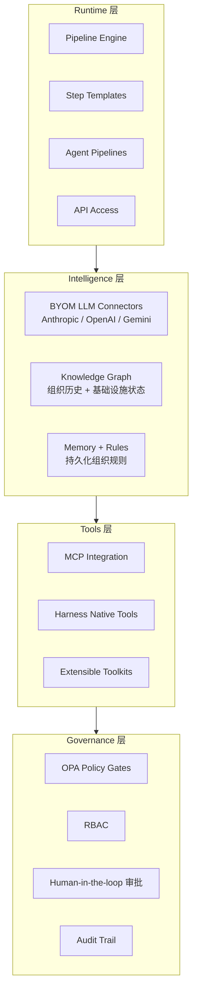

# Harness Agent

## 什么是 Harness Agent？

Harness Agent 是运行在 Harness CI/CD 平台内部的 **AI 自主执行单元**，以 pipeline step 的形式存在，继承 pipeline 的上下文、权限与治理机制。官方定位：pipeline-native 的 AI worker，负责执行 DevOps 任务——修复失败的 PR、生成测试、清理 feature flag、修复 Helm chart 等。

开源实现 **OpenHarness**（`openharness-ai` Python 包）将这套架构完整地复现为可独立部署的 agent harness 框架，核心理念是：

> "The model is the agent. The code is the harness."

即 LLM 本身就是 agent 的"大脑"，harness 是围绕它的全部基础设施：工具执行、权限、钩子、多 agent 协调、记忆、多 provider 适配。

---

## 整体架构（四层）



---

## 核心组件速览

### 1. Agent Loop（`QueryEngine`）
OpenHarness 的核心是 `QueryEngine.run_query()` — 一个 `while True` 异步生成器，实现标准 tool-use 循环：

1. Auto-compact 检查（token 阈值）
2. 流式获取模型响应
3. 多工具并发：`asyncio.gather()` 并行执行
4. 每个工具调用走 Pre-hook → 权限检查 → Pydantic 验证 → 执行 → Post-hook
5. 工具结果 append 为新 user message，继续循环

跨轮次状态通过 `tool_metadata` dict 传递（当前目标、已读文件、已调用 skill、活跃 artifact 等）。

### 2. 工具系统（43+ 工具）
所有工具继承 `BaseTool`，通过 Pydantic 做 input 校验，输出 `ToolResult`。工具分类：

| 类别 | 代表工具 |
|------|---------|
| 文件 I/O | `file_read`, `file_write`, `file_edit`, `glob`, `grep` |
| Shell | `bash_tool` |
| 搜索 | `web_fetch`, `web_search`, `lsp_tool` |
| 多 Agent | `agent_tool`, `send_message`, `team_create/delete` |
| 任务管理 | `task_create/get/list/update/stop/output` |
| MCP | `mcp_tool`, `list_mcp_resources`, `read_mcp_resource` |
| 工作流 | `enter_plan_mode`, `enter_worktree`, `skill_tool` |
| 调度 | `cron_create/list/delete`, `remote_trigger` |
| 元操作 | `config_tool`, `brief_tool`, `ask_user_question`, `todo_write` |

### 3. Agent 定义（YAML）
`AgentDefinition` Pydantic model，核心字段：

```yaml
name: my-agent
description: ...
system_prompt: |
  你是一个 ...
tools: ["file_read_tool", "bash_tool"]   # null = 所有工具
disallowed_tools: []
model: claude-opus-4-6
permission_mode: default   # default | acceptEdits | bypassPermissions | plan | dontAsk
max_turns: 50
skills: [...]
mcp_servers: {name: config}
hooks: {PreToolUse: [...]}
background: true
isolation: worktree        # worktree | remote
```

### 4. Multi-Agent 协调

#### Coordinator/Worker 分离
- Coordinator 仅用三个工具：`agent`、`send_message`、`task_stop`
- Worker 收到任务后在独立进程（`subprocess` backend）运行
- Worker 完成后以 `<task-notification>` XML 格式回传结果
- 协调逻辑完全由 system prompt 驱动，无独立代码路径

#### Swarm Backends
| Backend | 特点 |
|---------|------|
| `subprocess` | 生产默认，`oh --task-worker` 子进程 |
| `in_process` | asyncio 内部，不支持 task_tool 轮询 |
| `tmux` | 可视化多 pane |
| `iterm2` | macOS iTerm2 |

### 5. Hook 系统
四种 hook 类型，触发于 `PreToolUse` / `PostToolUse`：

| 类型 | 机制 | 默认阻断失败 |
|------|------|------------|
| `CommandHook` | Shell 命令，payload 在 `$ARGUMENTS` | 否 |
| `HttpHook` | HTTP POST | 否 |
| `PromptHook` | LLM 调用，返回 `{ok, reason}` | 是 |
| `AgentHook` | 同上但深度推理 | 是 |

任意 hook 返回 `blocked=True` 即可在工具执行前拦截。支持 `watchfiles` 热重载。

### 6. 权限系统
`PermissionChecker.evaluate()` 的策略链（有序）：

1. 硬编码敏感路径拒绝列表（SSH、云凭证、kubeconfig 等，不可覆盖）
2. 工具显式拒绝列表
3. 工具显式允许列表
4. 路径级 glob 规则
5. 命令级 deny 模式
6. Permission mode（`FULL_AUTO` / `DEFAULT` / `PLAN`）

### 7. MCP 集成
`McpClientManager` 管理多 MCP 服务器，支持 stdio 和 HTTP streamable 两种 transport。MCP 工具动态注入 ToolRegistry，类型从 JSON Schema 自动推断。

### 8. 记忆系统
文件级记忆，存于 `.openharness/memory/`，`MEMORY.md` 作索引。记忆在 `auto-compact`（上下文压缩）后保留，支持跨 session 持久化。

### 9. ohmo Gateway
`ohmo` 是构建在 harness 上的长驻个人 agent，支持 Telegram、Slack、Discord、飞书、钉钉等多平台接入。每个会话线程独立 `RuntimeBundle`（engine + tools + session）。

---

## 与 Claude Code / 通用 Agent 框架的对比

| 维度 | Harness Agent（OpenHarness） | 通用 Agent 框架 |
|------|------------------------------|----------------|
| 执行环境 | Pipeline step（或独立 harness） | 通用 |
| 治理 | OPA + RBAC + Audit trail（DevOps 级） | 框架自定义 |
| 工具扩展 | MCP + Harness native tools | MCP / 自定义 |
| 多 Agent | Coordinator/Worker + Swarm backend | 通常需自建 |
| 记忆 | 文件级，跨 session | 各框架差异大 |
| Provider | Anthropic / OpenAI / Gemini / Copilot | 框架决定 |
| 部署 | CI/CD pipeline 内 或 独立 gateway | 独立服务 |

---

## 已有深度分析

### Multi-Agent 系统（已完成）

| 页面 | 内容 |
|------|------|
| [[harness-agent/multi-agent-coordination\|Multi-Agent 协调机制]] | Coordinator system prompt 设计、Task notification 协议、并发模式（fan-out/fan-in、scratchpad、team 广播） |
| [[harness-agent/background-worker\|Background Worker 实现]] | TaskType 枚举、进程生命周期（pipe/log/watch）、`run_task_worker()` 入口、一次性设计与重启机制、结果回传路径 |
| [[harness-agent/inline-agent\|Inline Agent vs Background Worker]] | 两种委派模式对比、OpenHarness 的选择、in_process backend、选型决策树 |
| [[harness-agent/permission-sync\|权限同步协议]] | Worker → Coordinator 权限上报、Mailbox 原子写入、双轨设计历史、Team 生命周期管理 |
| [[harness-agent/memory-system\|记忆与上下文压缩]] | 持久记忆（文件级 memory/）、Auto-Compact 三级策略、CompactAttachments、tool_metadata 跨压缩传递 |

## 待深入的方向

以下方面尚未展开，按需选择：

1. **Agent Loop 与 tool-use 实现** — `QueryEngine` 内部、`tool_metadata` 状态管理（记忆系统已覆盖 compact 部分）
2. **Hook 与权限系统** — 四种 hook 类型、PermissionChecker 策略链、OPA 集成
3. **工具系统设计** — `BaseTool` 抽象、ToolRegistry、MCP 动态工具、43 工具分类
4. **Agent 定义与配置** — YAML schema、isolation 模式、per-agent 模型选择
5. **Provider 与 Auth 系统** — 多 Provider 适配、credential 解析优先级、BYOM
6. **ohmo Gateway 与多平台接入** — 长驻 agent、多 channel 适配、RuntimeBundle
7. **DevOps 场景与系统 Agent** — 10 个内置 System Agent、CI autofix、CD manifest remediator 等

---

## 参考资源

- 官方文档：https://developer.harness.io/docs/platform/harness-ai/harness-agents/
- OpenHarness 源码：`/Users/rancune/Work/github-open-source/OpenHarness`
- 系统 Agent 模板：https://github.com/thisrohangupta/agents
