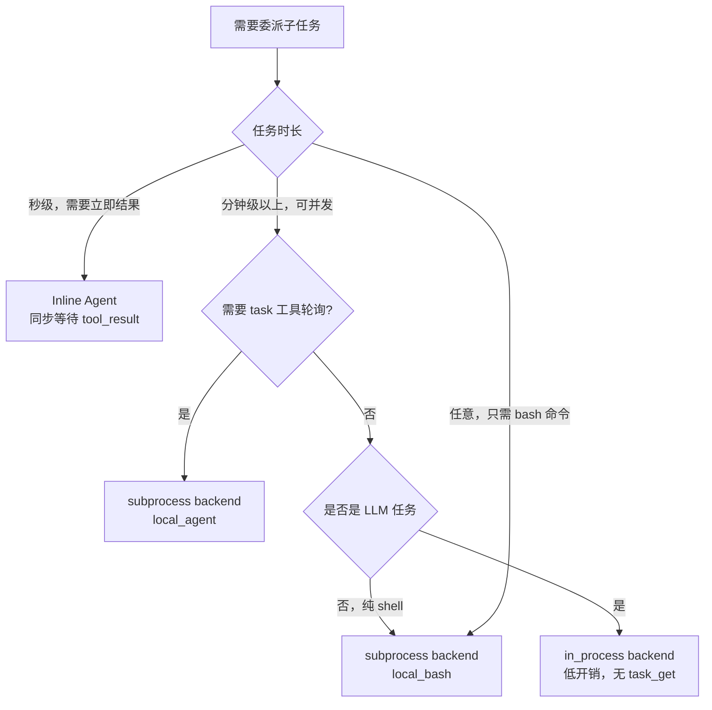

# Harness Agent — Inline Agent vs Background Worker

> 上级页面：[[Harness Agent]]  
> 相关页面：[[harness-agent/background-worker|Background Worker 实现]]、[[harness-agent/multi-agent-coordination|Multi-Agent 协调机制]]

---

## 一、两种 Agent 调用模式

在 multi-agent 系统中，orchestrator 委派子任务有两种根本不同的执行模式：

### Inline Agent（同步嵌套）

Orchestrator 调用 `agent` tool → **阻塞等待** → subagent 在同一 turn 内运行完毕 → tool_result 直接返回：

```
Orchestrator turn N:
  [tool_use: agent, {prompt: "..."}]
       ↓ 阻塞，当前 turn 不结束
  subagent 运行（可能多轮 LLM 调用）
       ↓ subagent 完成
  [tool_result: "研究结果：..."]
       ↓
  Orchestrator 继续，同一 turn 内拿到结果，
  可继续调用其他工具或生成最终回复
```

### Background Worker（异步并发）

Orchestrator 调用 `agent` tool → **立即返回 task_id** → worker 在独立进程异步运行 → 结果以 `<task-notification>` 形式注入：

```
Orchestrator turn N:
  [tool_use: agent, {prompt: "..."}]
  [tool_result: "Spawned researcher@default (task_id=a3f2b1c4)"]
  → end_turn，Orchestrator 等待

... 若干分钟后 ...

Orchestrator turn N+1（由 task-notification 触发）:
  [user: <task-notification><task-id>a3f2b1c4</task-id>...</task-notification>]
  → Orchestrator 处理结果
```

---

## 二、核心差异对比

| 维度 | Inline Agent | Background Worker |
|------|-------------|-------------------|
| **结果时机** | 同一 turn 内 | 异步，独立 turn |
| **Orchestrator 上下文** | tool_result 进 message history，subagent 内部过程不可见 | task-notification 的 result 字段进 message history，同样不可见内部过程 |
| **并发** | 多个 tool_use 并发（`asyncio.gather`，工具调用层） | 真正的进程级并发，OS 调度 |
| **任务时长** | 适合秒级～分钟级 | 适合分钟级以上 |
| **中断/恢复** | 不支持，subagent 崩溃则 tool_use 失败 | 支持，进程独立，可 `task_stop` |
| **KV cache** | subagent 与 orchestrator 共享同一对话 API session | 独立进程，各有独立 cache prefix |
| **轮询能力** | 无需，结果同步返回 | `task_get`/`task_output` 主动查询 |
| **适合的工作类型** | 需要 orchestrator 立刻基于结果决策的短任务 | 长时间运行、可并发、可监控的任务 |

---

## 三、OpenHarness 的选择

OpenHarness 的 `agent` tool **只实现了 Background Worker 模式**：

```python
# AgentTool.execute() — 强制 subprocess backend
executor = registry.get_executor("subprocess")
result = await executor.spawn(config)
# 立即返回 SpawnResult(task_id=..., agent_id=...)，不阻塞
```

原因是：Background Worker 的 task_id 可被 `task_get`/`task_list`/`task_output` 工具轮询，in_process 模式的内部 ID 对这些工具不可见。

**OpenHarness 中没有原生的 Inline Agent 工具。** Coordinator 的 `agent` tool 永远是异步的。

### Inline 语义的近似实现

如果需要同步等待结果，coordinator 可以在 tool_use 层并发调用多个 `agent`，然后在同一 turn 内用 `task_get` 轮询直到所有任务完成：

```
[tool_use: agent, {name: "researcher", ...}]
[tool_use: agent, {name: "scanner", ...}]
      ↓ asyncio.gather，两个 spawn 并发
[tool_result: task_id=a001]
[tool_result: task_id=a002]
      ↓ 下一步：coordinator 轮询
[tool_use: task_get, {task_id: "a001"}]  ← 检查是否完成
```

但这是"假同步"——coordinator 的 LLM 需要自己管理轮询逻辑，且结果在不同 turn 中到达，不如真正的 inline agent 直接。

---

## 四、in_process backend：中间地带

`InProcessBackend` 是 OpenHarness 中最接近 Inline Agent 的实现：

```python
# InProcessBackend.spawn()
task = asyncio.create_task(
    start_in_process_teammate(config=config, agent_id=agent_id, ...),
    name=f"teammate-{agent_id}",
)
```

Worker 是同一 Python 进程内的 asyncio Task，不是子进程。

**与 Inline Agent 的差异**：仍然是异步的，不阻塞当前 turn。orchestrator 依然需要通过 mailbox 接收结果。

**与 subprocess 的差异**：

| | in_process | subprocess |
|---|---|---|
| 进程边界 | 无（同一进程） | 独立子进程 |
| LLM 续接上下文 | 可保留（message_queue 注入） | 新进程，全新上下文 |
| task_get 可见性 | 否 | 是 |
| 故障隔离 | 弱（异常可能扩散） | 强 |
| 启动开销 | 极低 | 进程 fork + 解释器初始化 |

`InProcessBackend` 目前不被 `AgentTool` 使用（`AgentTool` 强制走 subprocess），但框架保留了这个后端供直接调用。

---

## 五、`_run_query_loop`：in_process worker 的 turn 注入机制

in_process backend 展示了一个有趣的 turn 注入模式，即使在异步模式下，它也能以接近 inline 的方式传递 orchestrator 的消息：

```python
async def _run_query_loop(query_context, config, ctx, mailbox):
    messages = [ConversationMessage.from_user_text(config.prompt)]

    async for event, usage in run_query(query_context, messages):
        # 每个 event 之间检查 mailbox
        should_stop = await _drain_mailbox(mailbox, ctx)
        if should_stop:
            return

        # 把 mailbox 里的新消息注入为额外 user turn
        while not ctx.message_queue.empty():
            queued = ctx.message_queue.get_nowait()
            messages.append(ConversationMessage(role="user", content=queued.text))
```

`messages` 列表在 `run_query` 的迭代过程中被动态追加。Worker LLM 在每个 event 之间都有机会看到 orchestrator 发来的新消息，做到**轮间注入（inter-turn injection）**，而不是等下一个完整的 QueryEngine 循环。

这比 subprocess 的重启方式代价小得多，但需要 worker 和 orchestrator 在同一事件循环中运行。

---

## 六、选型决策树



**OpenHarness 当前的实际路径**：`AgentTool` 只走 `subprocess local_agent`。`local_bash` 通过 `task_create` 工具可用。Inline Agent 目前无原生工具支持。

---

## 七、两种模式的本质差异只有一个

Inline Agent 和 Background Worker 的 subagent **都有独立的 `QueryEngine` 和 message history**，subagent 的内部推理过程对 orchestrator 同样不透明。Orchestrator 在两种模式下看到的内容结构相同：

```
Inline:
  [tool_use: agent, {prompt: "..."}]
  [tool_result: "subagent 最终文本"]       ← 只有最终输出

Background:
  [user: <task-notification>
    <result>subagent 最终文本</result>     ← 同样只有最终输出
  </task-notification>]
```

两者的根本差异只有**时机**：

- **Inline**：orchestrator 当前 turn **阻塞**，subagent 跑完后 tool_result 回来，orchestrator 继续同一 turn 处理结果，可以立即基于结果再调用其他工具
- **Background**：orchestrator 立即拿到 task_id，**当前 turn 结束**，subagent 异步运行，结果在未来某个 turn 以 task-notification 注入

**设计取舍因此是**：
- **需要立即基于结果继续决策**（同一 turn 内链式调用多个工具）→ Inline Agent
- **任务可独立、时间长、需要真正并发** → Background Worker

---

## 参考

- 源码：`src/openharness/swarm/in_process.py` — `InProcessBackend`、`_run_query_loop`
- 源码：`src/openharness/tools/agent_tool.py` — `AgentTool`
- 源码：`src/openharness/engine/query.py` — `run_query`
- 相关：[[harness-agent/background-worker|Background Worker 实现]] — subprocess 详细机制
- 相关：[[harness-agent/multi-agent-coordination|Multi-Agent 协调机制]] — coordinator/worker 架构
