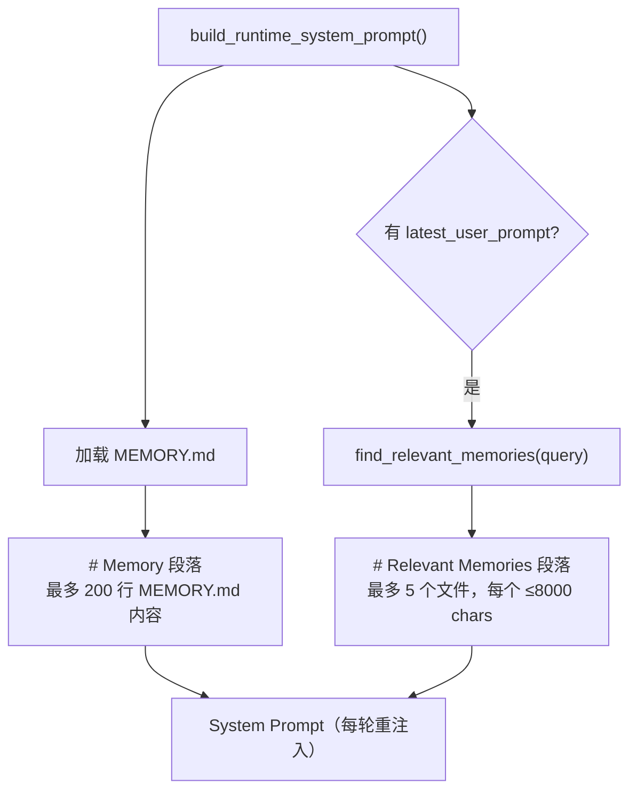
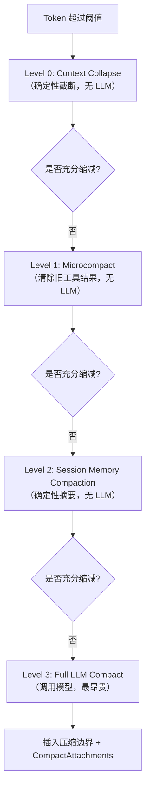
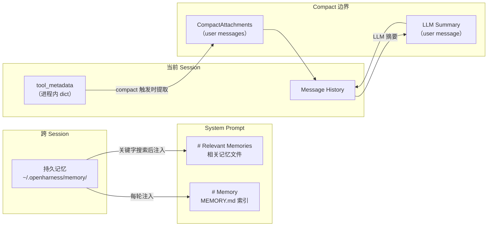

# Harness Agent — 记忆与上下文压缩

父页面：[[Harness Agent]]
相关：[[harness-agent/background-worker|Background Worker 实现]]

OpenHarness 的记忆体系由两套独立机制构成：**持久记忆**（文件系统，跨 session）和 **Auto-Compact**（上下文压缩，跨 compact 边界）。二者目标不同，写入者不同，注入方式也不同，但共同解决同一个核心问题：如何让 Agent 在有限的 context window 内保持足够的长期状态。

---

## 1. 持久记忆（Persistent Memory）

### 存储布局

记忆文件存储在用户家目录下，按项目隔离：

```
~/.openharness/memory/<project-name>-<sha1(cwd)[:12]>/
├── MEMORY.md          ← 索引文件，bullet links 指向各 topic
├── <slug-a>.md        ← 一个 topic 一个文件
├── <slug-b>.md
└── ...
```

项目标识符 = `project-name` + `-` + `sha1(当前工作目录)[:12]`，保证不同项目的记忆相互隔离。

### 文件格式

每个记忆文件支持可选 YAML frontmatter：

```markdown
---
name: "Human-readable title"
description: "Short summary"
type: "preference|project|fact|..."
---
Body content...
```

无 frontmatter 时，第一个非空行作为 description。这个设计使记忆文件对人类可读，可直接在编辑器中查看和修改。

### 核心 API（`memory/manager.py`）

```python
add_memory_entry(cwd, title, content) -> Path
    # title → slug（正则清洗）
    # 原子写入：exclusive_file_lock → tmp file → os.replace
    # 若 MEMORY.md 中没有该条目则追加 "- [title](slug.md)"

remove_memory_entry(cwd, name) -> bool
    # unlink 文件，从 MEMORY.md 删除对应行
```

原子写入（`os.replace`）防止并发写入时文件损坏，`exclusive_file_lock` 保证同一时刻只有一个写入者。

### 数据结构（`memory/scan.py`）

```python
@dataclass(frozen=True)
class MemoryHeader:
    path: Path
    title: str
    description: str
    modified_at: float
    memory_type: str = ""
    body_preview: str = ""  # body 前 300 字符（排除 title 行）
```

`frozen=True` 使 header 不可变，可安全用作 dict key 或放入 set。

### 相关性搜索（`memory/search.py`）

`find_relevant_memories(query, cwd, max_results=5)` 实现了一个轻量级关键字匹配搜索：

- **分词**：ASCII 单词（≥3 字符）+ 汉字（每个字单独作为 token）
- **评分**：`score = meta_hits × 2.0 + body_hits`（元数据权重 2 倍）
- **排序**：score 降序，同分时按 `modified_at` 降序（最近修改优先）

无向量嵌入，无语义相似度——纯关键字匹配已足够满足结构化记忆的检索需求，且无需外部依赖。

### 注入系统 Prompt（`prompts/context.py`）



关键设计决策：记忆注入在 **system prompt** 而非 message history。这意味着：
1. 每轮对话都重新注入（保持最新）
2. 受益于 KV cache prefix stability——只要 system prompt 内容不变，前缀缓存命中
3. 不占用 message history 的 token 配额

配置项（`settings`）：

| Key | Default | 含义 |
|-----|---------|------|
| `memory.enabled` | `True` | 是否启用持久记忆 |
| `memory.max_files` | `5` | 相关记忆最多注入文件数 |
| `memory.max_entrypoint_lines` | `200` | MEMORY.md 读取行数上限 |

---

## 2. Auto-Compact（上下文压缩）

Auto-Compact 解决的是 context window 耗尽问题。当 token 数接近上限时，系统自动压缩历史消息，同时通过 **CompactAttachments** 机制保留关键结构化状态，使 Agent 在压缩后仍能继续执行任务。

### 触发时机

在 `engine/query.py` 的主循环中，每轮调用 LLM **之前**执行 compact 检查：

```python
while context.max_turns is None or turn_count < context.max_turns:
    turn_count += 1
    # compact 检查在 LLM 调用之前
    async for event, usage in _stream_compaction(trigger="auto"):
        yield event, usage
    messages, was_compacted = last_compaction_result
    # 然后才调用 LLM
```

触发阈值：`context_window - 20000（summary budget）- 13000（buffer）`，对于 200k 模型约为 167,000 tokens。

`AutoCompactState` 跟踪连续失败次数——连续失败 3 次后，本 session 内禁用 auto-compact。

### 三级压缩策略



#### Level 0 — Context Collapse（确定性截断）

对较旧消息中的长文本块（>2400 chars）进行截断：保留头部 900 chars + 尾部 500 chars，折叠中间内容。

- **无 LLM 调用**，纯字符串处理
- `try_context_collapse(messages, preserve_recent=N) -> list | None`
- 适合快速缩减超长工具输出（如大文件读取结果）

#### Level 1 — Microcompact（工具结果清除）

```python
COMPACTABLE_TOOLS = {
    "read_file", "bash", "grep", "glob",
    "web_search", "web_fetch", "edit_file", "write_file"
}
DEFAULT_KEEP_RECENT = 5
TIME_BASED_MC_CLEARED_MESSAGE = "[Old tool result content cleared]"
```

逻辑：
1. 收集所有 compactable 工具的 `tool_use` ID
2. 保留最近 `keep_recent=5` 个，清除更早的
3. 将旧 `ToolResultBlock.content` 替换为 `"[Old tool result content cleared]"`

无 LLM 调用，立即节省 tokens，适合消息数量多但旧工具结果已无价值的场景。

#### Level 2 — Session Memory Compaction（会话历史摘要）

`try_session_memory_compaction(messages, preserve_recent=12)`：

- 将较旧消息压缩为简短的"session memory"消息
- 格式：每条消息一行（最多 48 行 / 4000 chars）
  - 文本消息：`{role}: {前 160 chars}`
  - 工具调用：`{role}: tool calls -> name1, name2`
- 仅当实际能减少 token 数时才启用

无 LLM 调用，确定性，损失信息但保留结构。

#### Level 3 — Full LLM Compact（完整模型压缩）

最重量级的压缩，步骤：

1. 先执行 Microcompact
2. 分割：`older = messages[:-6]`，`newer = messages[-6:]`
3. 调用 LLM，使用结构化 prompt 请求 9 段式摘要
4. 摘要通过 `build_compact_summary_message()` 包装，注入为 user message
5. 超时 25 秒，最多重试 3 次
6. 若出现"prompt too long"错误，截断最旧 20% 的轮次后重试（最多 3 次）
7. 摘要最大输出 tokens：20,000

### 压缩后消息结构

```
[Compact boundary marker]       ← 元数据：trigger, 压缩前/后消息数, token 数
[LLM summary message]           ← "This session is being continued..."
[messages_to_keep]              ← 最近 6 条消息（原文保留）
[attachment: task_focus]
[attachment: recent_files]
[attachment: recent_verified_work]
[attachment: recent_attachments]
[attachment: plan]
[attachment: invoked_skills]
[attachment: async_agents]
[attachment: recent_work_log]
[hook attachment]               ← 若 pre-compact hook 返回了 note
```

### CompactAttachments — 跨压缩边界的结构化状态

CompactAttachments 是 Auto-Compact 最关键的设计：将无法从 LLM 摘要中可靠恢复的结构化状态，以独立 user message 的形式附加在压缩边界之后。

| Attachment 类型 | 数据来源 | 内容 |
|---|---|---|
| `task_focus` | `tool_metadata["task_focus_state"]` | 当前目标、近期目标、活跃 artifact、已验证状态、下一步 |
| `recent_verified_work` | `tool_metadata["recent_verified_work"]` | 最近 8 个已验证步骤 |
| `recent_attachments` | image paths + 消息中的 `[attachment: ...]` 模式 | 需要保留在工作记忆中的文件路径 |
| `recent_files` | `tool_metadata["read_file_state"]` | 最近 4 个读取文件（path + span + preview） |
| `plan` | `tool_metadata["permission_mode"]` | plan 模式激活时的提醒 |
| `invoked_skills` | `tool_metadata["invoked_skills"]` | 最近 8 个使用的 skill |
| `async_agents` | `tool_metadata["async_agent_state"]` | 最近 6 个后台任务条目（详见 [[harness-agent/background-worker|Background Worker 实现]]） |
| `recent_work_log` | `tool_metadata["recent_work_log"]` | 最近 8 个工作检查点 |

每个 attachment 序列化格式：

```
[Compact attachment: <kind>] <title>
<body>
```

### `tool_metadata` — 跨轮次状态字典

`tool_metadata` 是贯穿所有工具执行的可变状态字典，CompactAttachments 从它读取数据。它的生命周期与 session 相同——进程重启后消失，但在 compact 边界处通过 attachment 机制实现了"逻辑上的持久化"。

工具执行时可读写 `tool_metadata`，例如 `read_file` 工具在执行后会更新 `tool_metadata["read_file_state"]`，从而在下次压缩时被携带过去。

---

## 两套机制的对比

| 维度 | 持久记忆 | Auto-Compact / tool_metadata |
|------|---------|------------------------------|
| 存储位置 | `~/.openharness/memory/` 文件系统 | 进程内 dict + 压缩消息 |
| 生命周期 | 跨 session、跨 restart | 仅限当前 session |
| 写入者 | LLM 工具调用（显式） | 工具执行 hook（隐式） |
| 读入上下文方式 | System prompt（每轮重注入） | CompactAttachments（仅在 compact 时） |
| 检索机制 | 关键字相关性评分 | 固定类型，全量注入 |
| Restart 后存活 | 是 | 否 |

### 设计意图

两套机制对应两类不同性质的知识：

- **持久记忆**：用户偏好、项目约定、长期事实——这类知识需要跨 session 保留，且需要按相关性选择性注入，避免无关记忆稀释 context
- **Auto-Compact**：任务进度、读取过的文件、调用过的 skill——这类知识只在当前任务执行期间有效，通过 tool_metadata 自动积累，在压缩时以结构化格式保留关键片段



---

## 实现注意事项

**System prompt 注入与 KV cache**：持久记忆注入在 system prompt，只要记忆内容不变，KV cache prefix 保持稳定。若记忆文件频繁变动（如每轮都写新记忆），会导致 cache miss，增加延迟和成本。建议仅在必要时写入记忆。

**Microcompact 的 `keep_recent=5`**：保留最近 5 个工具结果的设计假设近期工具调用最有参考价值。对于需要频繁回溯早期结果的任务（如大规模代码重构），这个参数可能需要调整。

**Full LLM Compact 的 9 段结构**：压缩摘要要求模型输出结构化内容，这对模型的指令遵循能力有要求。若模型输出格式不符，重试逻辑会触发，但最终仍可能丢失部分信息。

**CompactAttachments 与 message history**：attachments 作为 user message 注入，会被后续 LLM 调用看到，但也会随着新一轮消息积累而逐渐"沉入"历史。下次 compact 时，新的 attachments 会覆盖旧的，确保结构化状态始终是最新的。
