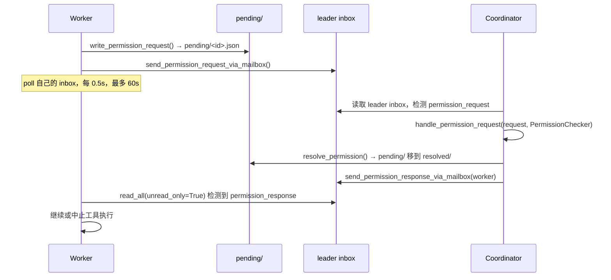

# Harness Agent — 权限同步协议

> 上级页面：[[Harness Agent]]  
> 相关页面：[[harness-agent/multi-agent-coordination|Multi-Agent 协调机制]]、[[harness-agent/background-worker|Background Worker 实现]]

Worker 在 swarm 中运行时，遇到需要审批的工具操作，需要把权限请求上报给 coordinator。本文描述这套协议的完整实现。

---

## 一、文件目录结构

所有 swarm 状态都在文件系统上：

```
~/.openharness/teams/<team>/
├── team.json                          # TeamFile：成员表、lead_agent_id
├── agents/
│   └── <agent_id>/
│       └── inbox/                     # TeammateMailbox
│           ├── <ts>_<uuid>.json       # 每条消息一个文件
│           └── .write_lock
└── permissions/
    ├── pending/
    │   └── perm-<ts>-<rand7>.json     # 待审批请求
    └── resolved/
        └── perm-<ts>-<rand7>.json     # 已审批记录（1h 后清理）
```

---

## 二、消息类型

```python
MessageType = Literal[
    "user_message",
    "permission_request",           # worker → leader
    "permission_response",          # leader → worker
    "sandbox_permission_request",   # worker → leader：需要网络访问
    "sandbox_permission_response",
    "shutdown",
    "idle_notification",            # worker → leader：我完成了
]
```

---

## 三、权限请求完整流程



### 决策逻辑

```python
def handle_permission_request(request, checker):
    # 只读工具直接批准，不经 PermissionChecker
    if _is_read_only(request.tool_name):
        return SwarmPermissionResponse(allowed=True)

    # 其余走 PermissionChecker 策略链
    decision = checker.evaluate(
        request.tool_name,
        is_read_only=False,
        file_path=request.input.get("file_path"),
        command=request.input.get("command"),
    )
    return SwarmPermissionResponse(
        allowed=decision.allowed,
        feedback=None if decision.allowed else decision.reason,
    )
```

只读工具白名单：`read_file, glob, grep, web_fetch, web_search, task_get, task_list, task_output, cron_list`。

---

## 四、Mailbox 实现

### 原子写入

```python
async def write(self, msg: MailboxMessage) -> None:
    # tmp → rename，POSIX 原子操作
    def _write_atomic():
        with exclusive_file_lock(lock_path):
            tmp_path.write_text(payload)
            os.replace(tmp_path, final_path)

    await loop.run_in_executor(None, _write_atomic)  # 线程池，不阻塞事件循环
```

文件名 `<timestamp:.6f>_<uuid>.json`，`sorted(inbox.glob("*.json"))` 即得时序有序列表。

### 消息路由

`write_to_mailbox(recipient_name, message, team_name)` 通过检测 JSON `type` 字段自动设置 `MessageType`，无需调用方手动指定。

---

## 五、双轨设计的历史原因

权限协议同时存在两套机制：

| | 文件系统（pending/resolved） | Mailbox |
|---|---|---|
| 诞生时间 | 早期实现 | 后期添加 |
| 语义 | 简单，pending → resolved 状态机 | 完整消息类型（shutdown、idle 等） |
| 注释建议 | — | `for new code prefer mailbox` |

当前代码两套并行存在，向完全 mailbox 化迁移中。

---

## 六、Sandbox 权限：网络访问控制

Worker sandbox 需要访问某个 host 时，走独立消息类型：

```python
# worker 侧
await send_sandbox_permission_request_via_mailbox(
    host="api.example.com", request_id="sandbox-<ts>-<rand7>"
)

# coordinator 批准后
await send_sandbox_permission_response_via_mailbox(
    worker_name, request_id, host, allow=True
)
```

Coordinator 成为网络访问的中央审批点，对应 Harness 平台的 MCP Gateway Proxy 概念。

---

## 七、Team 生命周期

### TeamRegistry（内存）vs TeamLifecycleManager（磁盘）

| | TeamRegistry | TeamLifecycleManager |
|---|---|---|
| 存储 | 进程内 dict | `~/.openharness/teams/<name>/team.json` |
| 速度 | O(1) | 文件 I/O |
| 持久性 | 进程重启丢失 | 跨进程可见 |
| 用途 | coordinator 内快速广播 | 权限同步、pane 发现、崩溃恢复 |

### Session 清理

Coordinator 退出时 `cleanup_session_teams()` 顺序执行：

1. Kill 所有 pane-backed worker 的 tmux/iTerm2 pane（避免孤儿进程）
2. `git worktree remove --force` 删除各 worker 的 worktree
3. `shutil.rmtree` 删除 `~/.openharness/teams/<name>/` 整个目录

跨 session 的 team 状态**不持久化**——coordinator 退出即清理，无法恢复未完成 worker。

---

## 参考

- 源码：`src/openharness/swarm/permission_sync.py`
- 源码：`src/openharness/swarm/mailbox.py`
- 源码：`src/openharness/swarm/team_lifecycle.py`
- 相关：[[harness-agent/multi-agent-coordination|Multi-Agent 协调机制]]
- 相关：[[harness-agent/background-worker|Background Worker 实现]]
