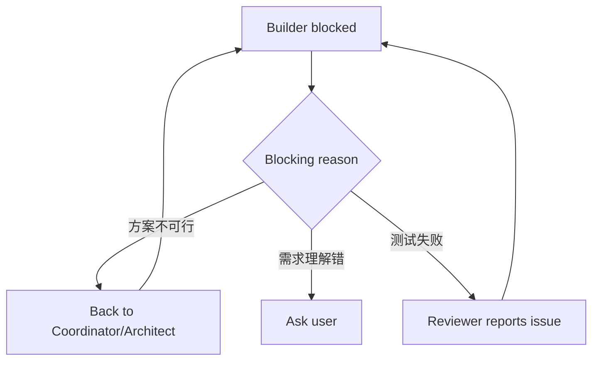

# Multi-Agent Workflow — Checkpoints

> 上级页面：[[llm/concepts/multi-agent-workflow/index|Multi-Agent Workflow]]

## 按等级压缩 checkpoint

| 等级 | Checkpoint 策略 |
|---|---|
| S0 | 不 checkpoint，做完汇报 |
| S1 | 最多 1 个，通常是方案选择或验收 |
| S2 | 使用完整 4 个 checkpoint |

## S2 四个 Human Checkpoint

1. **需求定稿**：目标、非目标、验收标准是否正确。
2. **方案选择**：MVP / 稳健版 / 长期版选哪个。
3. **验收**：实现和验证结果是否接受。
4. **沉淀确认**：哪些内容写入 wiki / MEMORY / skill。

其余中间过程 Agent 自走，避免频繁打扰用户。

## 回退协议

默认规则：

- Builder 卡住时，先回 Coordinator/Architect。
- 只有发现原需求理解错、权限缺失、外部服务不可用时才打扰用户。
- Reviewer 发现 bug 时，先交给 Builder 修；只有涉及产品取舍才回用户。

## 中止条件

- 用户拒绝需求定稿。
- 缺少无法替代的凭证/权限。
- 真实测试失败且需要用户决定取舍。
- 发现任务等级估错，需要升级到 S2。
- 用户明确暂停或要求只讨论不实现。

