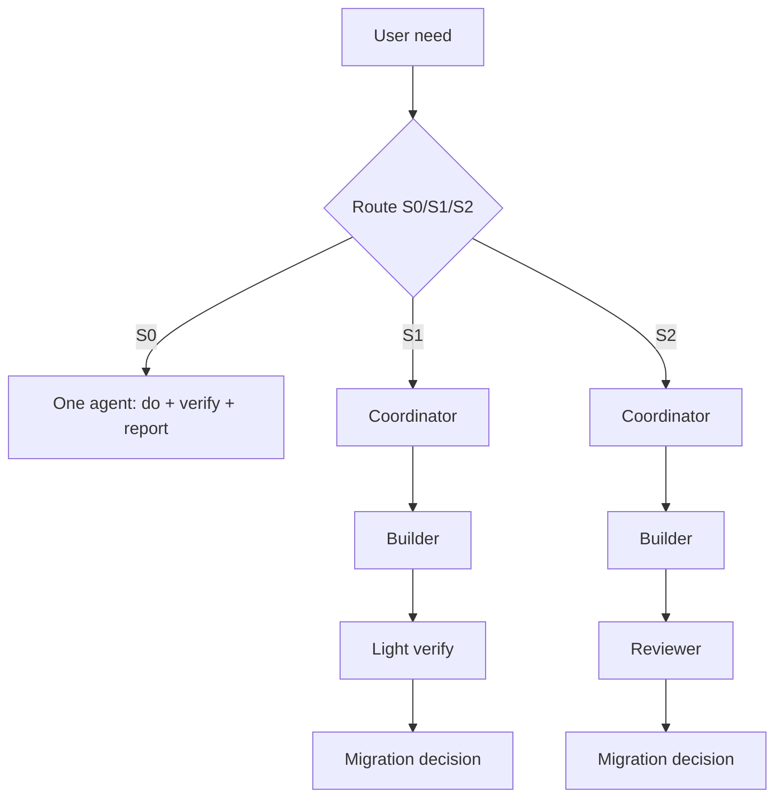

# Multi-Agent Workflow

> 配套 SOP：[[life/workflows/request-to-automation|Request to Automation]]

> 目标：把一句日常生活/工作需求稳定转成可执行自动化能力，同时控制 Slock 中的 Agent 数量和沟通噪音。

本工作流适用于“用户提出一个生活/工作需求，Agent 帮忙澄清、分析、看现有代码、实现、测试、泛化，并沉淀到个人 wiki / memory / skill”的场景。

核心原则：

1. 按任务复杂度选择最小 Agent 集合。
2. 每个 Agent 必须有明确产物。
3. 代码实现和验证分离。
4. 每次任务结束必须做迁移决策：哪些内容进入 repo docs、Obsidian wiki、MEMORY 或 skill；没有 promote 的临时上下文默认丢弃。

## Aspect pages

- [[llm/concepts/multi-agent-workflow/routing|Routing]] — S0/S1/S2 分级、何时不用多 Agent。
- [[llm/concepts/multi-agent-workflow/roles|Roles]] — Coordinator / Builder / Reviewer 三个真实 Agent 的职责和边界。
- [[llm/concepts/multi-agent-workflow/checkpoints|Checkpoints]] — Human checkpoint、回退协议、中止协议。
- [[llm/concepts/multi-agent-workflow/artifacts|Artifacts]] — 产物模板、迁移规则、skill 化建议。

## 为什么不是 6 个真实 Agent

Planner、Architect、Scout、Builder、Reviewer、Librarian 是职责，不一定是 6 个 Slock 身份。真实 Agent 过多会带来：

- Slock thread 噪音增加。
- 上下文重复传递。
- 决策权分散。
- 小任务流程成本过高。

因此把职责压缩成最多 3 个真实 Agent：Coordinator、Builder、Reviewer。S0 小任务甚至只用一个 Agent。

## 示例：播客抓取任务

“从播客 RSS 抓取音频并镜像到 CDN”属于 S1：

- 目标明确，风险可控。
- 需要看现有 Yatoro monorepo 和 CLI/library 上传能力。
- 不需要独立 Reviewer 常驻。
- 因为未来预期有 RSS、Playwright、站点脚本等多 source，`adapter + runner + state + upload sink` 被标记为可复用模式。

迁移结果：

- repo：CLI README 记录 `yatoro capture rss` 用法。
- memory：记录 Yatoro monorepo 结构、capture 实现提交、验证结果。
- skill 候选：`yatoro-capture`，用于模型以后调用抓取能力。
- wiki：本 workflow 页面记录协作方法。

## Open questions

- Coordinator 是否应由当前被 @mention 的 Agent 自动担任，还是由用户显式指定？
- Obsidian wiki 和 Agent MEMORY 的边界是否需要更严格的同步协议？
- Slock 是否需要原生支持 Work Order / Verification Report / Migration Decision 这类结构化消息？
