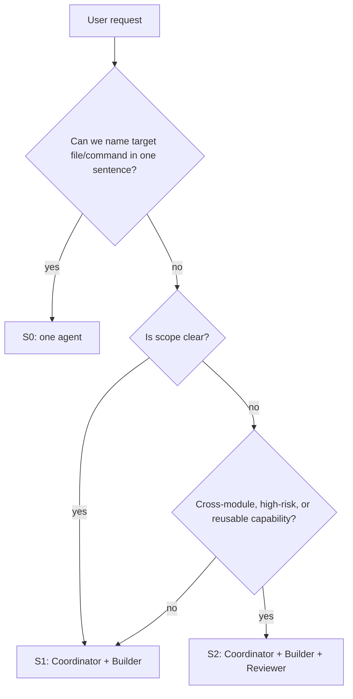

# Multi-Agent Workflow — Routing

> 上级页面：[[llm/concepts/multi-agent-workflow/index|Multi-Agent Workflow]]

## S0 / S1 / S2

| 等级 | 何时使用 | Agent 数量 | Checkpoint | 例子 |
|---|---|---:|---|---|
| S0 小任务 | 能一句话说清楚要改哪里或要查什么 | 1 | 无；做完汇报 | 查命令、小文案、小 bug、单文件修复 |
| S1 中任务 | 目标明确，但需要看代码或做小方案 | 2 | 最多 1 个，通常是方案或验收 | 新增 CLI 子命令、接一个 API、改一段流程 |
| S2 大任务 | 跨模块、需求模糊、需要长期沉淀或高风险 | 3 | 4 个 checkpoint | 新自动化系统、多来源抓取、需要抽象成 skill |

判断口径：

- 如果“要改哪个文件/执行哪个命令”能一句话说清楚，优先 S0。
- 如果需要先看代码但范围明确，优先 S1。
- 如果需求会演化成长期能力，或会影响多个模块，使用 S2。

## 路由流程

## 反过度设计规则

- 不因为“可以开 Agent”就开 Agent。
- 不因为流程模板存在就强制 checkpoint。
- 不把小任务写成完整工作流文档。
- 当用户只问概念或建议时，直接回答，不创建 Builder。

## 升级条件

S0 升级到 S1：

- 发现需要改多个文件。
- 发现 git worktree 有冲突或未理解的已有改动。
- 需要用户在方案 A/B 之间选择。

S1 升级到 S2：

- 改动跨多个系统。
- 需要独立验证才能避免自证。
- 需要抽象成长期能力、skill 或 wiki 模式。

