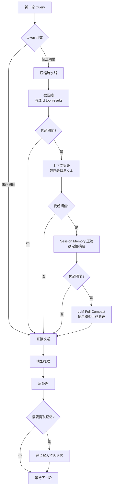

# Context Window Management

> 对话历史与 context window 的管理是 LLM Agent 系统的核心基础设施问题。本目录从三个工程实现（Claude Code、OpenClaw、OpenHarness）中提炼出通用模式，分四个层面展开。

## 核心问题

LLM 的 context window 是有限资源（通常 200K tokens）。Agent 系统面临三重矛盾：

1. **完整性 vs 长度**：历史对话越完整，越容易撑爆窗口
2. **实时性 vs 持久性**：当前会话的信息需要跨会话保留
3. **精确性 vs 成本**：精确的 token 计数需要额外 API 调用

## 四个层面

| 层面 | 文档 | 核心问题 |
|------|------|---------|
| 压缩策略 | [[llm/memory/context-compression\|Context Compression]] | 触发时机、压缩算法 |
| 内存管理 | [[llm/memory/memory-persistence\|Memory Persistence]] | 会话内/跨会话记忆存储 |
| 召回检索 | [[llm/memory/recall-retrieval\|Recall & Retrieval]] | 如何在正确时机注入正确记忆 |
| 实现对比 | [[llm/memory/implementation-comparison\|Implementation Comparison]] | 三个系统的设计差异 |

## 通用架构

## 关键常量（三系统共同参考）

| 常量 | 典型值 | 含义 |
|------|--------|------|
| Context Window | 200,000 tokens | 模型最大输入长度 |
| Reserved for Output | 20,000 tokens | 为模型输出预留空间 |
| Autocompact Buffer | 13,000 tokens | 触发压缩的安全边距 |
| **Effective Threshold** | ~167,000 tokens | = Window - Reserved - Buffer |
| Min Keep Recent | 6–12 turns | 压缩后至少保留的最近轮数 |
| Token Estimation | chars / 4 | 粗估 token 数的经验公式 |
