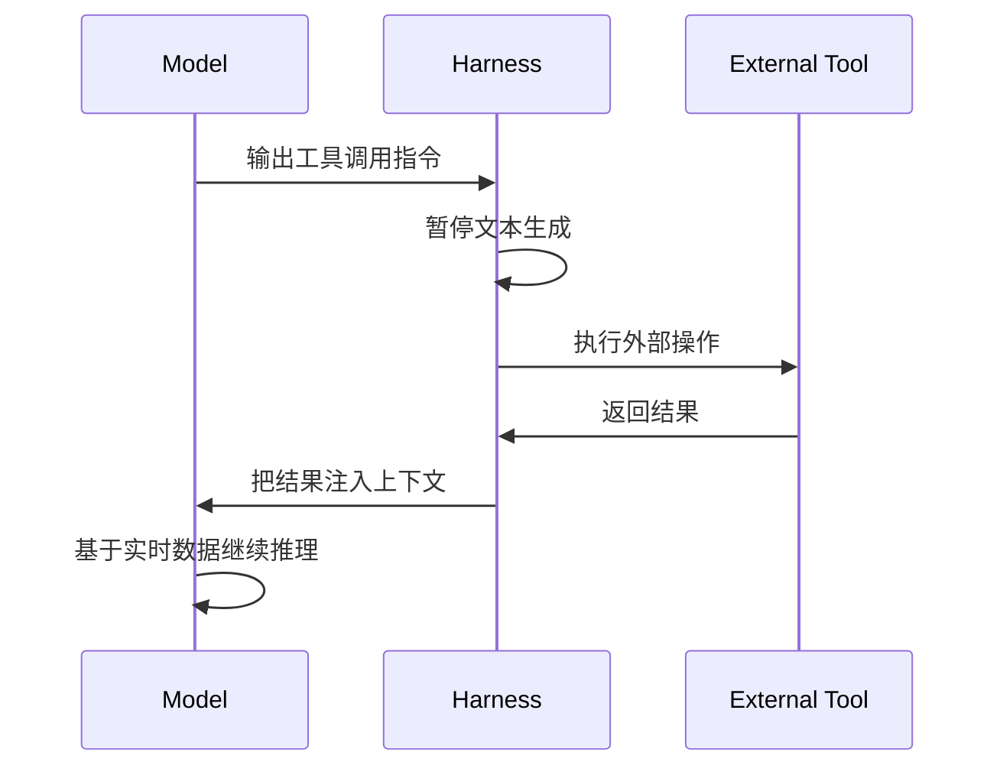

# What Is an Agent Harness (Parallel.ai)

**来源**：Parallel.ai  
**原文**：[raw/llm/articles/agents-harness/parallel-what-is-agent-harness.md](../../raw/llm/articles/agents-harness/parallel-what-is-agent-harness.md)

---

## 定义

Agent Harness 是围绕 AI 模型的软件基础设施，管理模型之外的一切。

> "The complete architectural system surrounding an LLM that manages the lifecycle of context: from intent capture through specification, compilation, execution, verification, and persistence."

**核心结论**：

> "The harness makes or breaks an AI product."

使用相同 LLM 的两个产品，因 harness 质量不同会产生截然不同的用户体验。

---

## 工具调用执行流程

当模型输出工具调用指令（如 `search("query")`），harness 的响应流程：

---

## 多级记忆架构

| 层级 | 内容 | 时效 |
|------|------|------|
| Working context | 临时 prompt 数据 | 当前调用 |
| Session state | 持久任务日志，每个任务重置 | 当前任务 |
| Long-term memory | 跨时间的持久知识库 | 永久 |

---

## Harness vs 相关概念对比

| 概念 | 角色 |
|------|------|
| **Agent Framework** (LangChain, LlamaIndex) | 构建 agent 的积木，提供可复用组件 |
| **Agent Harness** | 完整运行时系统，有主张的默认配置，通常内部使用 framework |
| **Orchestrator** | 控制何时如何调用模型（"大脑"） |
| **Harness** | 提供能力和副作用，如工具和上下文（"双手"） |
| **Test Harness** | 软件测试框架，比 agent harness 范围窄得多 |

---

## 关键效益数据

- **10-100x token 减少**：把推理移出模型，只提供精确需要的信息
- 相同 LLM + 不同 harness → 截然不同的任务成功率
- Harness 是 model-agnostic：替换底层模型不需要重写 harness

---

## 真实案例

- **Claude Agent SDK**：Anthropic 的通用 harness 参考实现，含 auto-compaction、工具执行、跨会话进度日志
- **LangChain DeepAgents**：默认 prompt、工具处理、规划工具、文件系统访问的 ready-to-use harness
- **学术游戏 Agent Harness**：感知 + 记忆 + 推理模块 × GPT-4 级模型，跨多种游戏胜率显著高于无 harness 基线

---

## 本文的独特贡献

相比其他 harness 文章，本文特别强调：
1. **Context lifecycle** 视角：把 harness 定义为管理"intent → specification → compilation → execution → verification → persistence"全生命周期的系统
2. **Orchestrator / Harness 分工**明确："大脑"与"双手"的分工模型
3. **Model-agnostic 特性**：同一 harness 可以热切换不同 LLM

---

## 关联概念

- [[llm/concepts/agents-harness/what-is-harness|What Is Harness]] — 定义层的扩展讨论
- [[llm/concepts/agents-harness/core-components|Core Components]] — 本文组件的详细拆解
- [[llm/memory/index|Context Window Management]] — 多级记忆架构的技术实现
